## INTRODUCTION
In the dynamic realm of digital commerce, E-commerce sales analysis plays a pivotal role on unraveling the intricacies of online transactions and customer behaviors. This analytical approach involves dissecting transactional data, evaluating customer interactions, and staying attuned to market trends to extract actionable insights that steer strategic decision-making.

## DATASET OVERVIEW
The dataset was gotten from Kaggle, through Zion Tech-Hub mentorship program, it has information of sales and customer information from year 2015 to 2022.

I used Microsoft Excel and Power bi to carry out the exploratory data analysis and visualization.

The absence of data for years 2019 and 2020 is likely attributed to the significant disruptions caused by the COVID-19 pandemic. The global crisis had far-reaching effects on businesses, potentially leading to data collection gaps during this period.

## DATA PREPROCESSING
The dataset underwent rigorous cleaning and preprocessing to ensure accuracy and consistency. Took the following steps;

- Uploaded the dataset to “Power Query Editor” through “Get Data” in Microsoft Excel, selected load and transform option and went ahead to clean up.
- Renamed columns properly, trimmed to remove extra spaces, removed duplicates on unique column like “Order ID”, capitalized each word after spaces and made sure each columns have its data type identified correctly.
- In “Product Category” column, changed about 13 rows containing ‘Tech’ to ‘Technology’ by filtering and selecting replace values options.

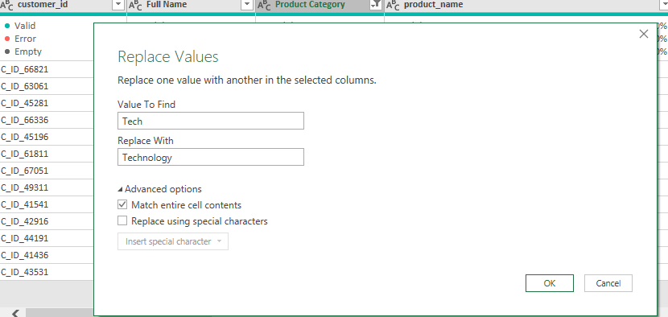

 Above cleaning was also applied on ‘furnitures’ with 20 rows and was replaced ‘Furniture’, also ‘Home’ to ‘Home office’ in “Customer Segment” column, ‘Late’ to ‘Late Delivery’ in “Delivery Status” column.
-	Clicked on Load and applied the changes.
-	Loaded the cleaned dataset to Power bi and created new calculated columns for the following;
1.	“Total Sales” = (sales_Per_Order * Order_Quantity) – (Order_Item_Discount * Oder_Quantity)
2.	“Total Profit” = Profit_Per_Order * Order_Quantity
3.	To get the maximum and minimum time, used the “DATEDIFF” function
Delivery Time = DATEDIFF([Order_Date], [Ship_Date], Day)

cleaned dataset

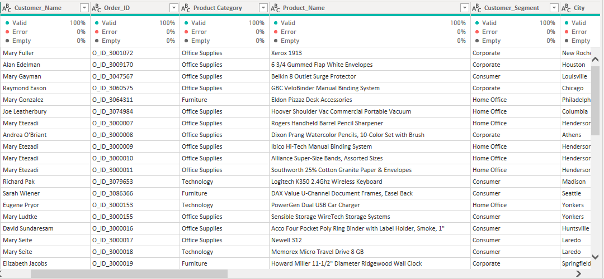

## BUSINESS TASK
The goal of this data analysis is to delve into the intricacies of E-commerce sales to identify overall sales trends and exploiting data-driven insights to identify potential areas of improvement.

In order to tackle this business problem, I will be answering the following business questions:
1.	What is top 5 selling products?
2.	What are the average sales per each product category?
3.	Top 10 customers in terms of sales generated?
4.	What is the overall trend in sales over time?
5.	What is the distribution of sales per order?
6.	Which customer segments contribute the most to overall sales, and how do they compare to one another?
7.	How does order item discount affect both sales per order and profit per order?
8.	How do different shipping types impact the delivery status of orders?
9.	Are there any customer regions that stand out in terms of sales performance?
    
## OBSERVATIONS
1.	Total Revenue = $44.73M
2.	Total Profit = $5.67M
3.	Number of Products= 1,849
4.	Number of items sold= 118,186
5. Maximum delivery time is 329days
6.	No dataset for the years 2019 and 2020
7.	The total sales in 2015 were $361,183.17, which were similar to the sales in 2016 at $356,349.02. However, there was a notable increase in 2017 with total sales of $444,907.42, followed by an even greater increase in 2018 with $600,314.82 in total sales. There was another significant surge in 2021 with total sales of $20,468,730.73, and this continued into 2022 with total sales of $22,498,092.
8.	Presence of outliers in sales per order.

## ANALYSIS AND INSIGHTS
1. What is top 5 selling products?

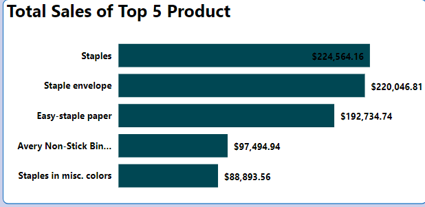
   
The analysis shows staples brought in the highest revenue with $224,564.16, following by staples envelope, Easy-staple paper, Avery non-sticker binders and Staples in misc.colors.

2. What are the average sales per each product category?

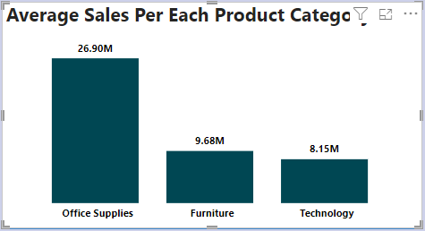
   
Analyzing the average sales per product category provides valuable insights into the relative performance of different categories. 

The analysis of average sales per product category unveils that the Office Supplies category dominates with an average of $26,897,432.1, significantly surpassing both Furniture at $9,683,591.57 and Technology at $8,148,554.2.

3.	Top 10 customers in terms of sales generated?

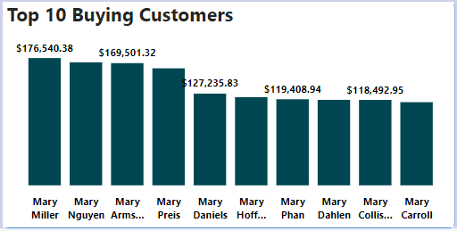
   
The top 10 customers significantly contribute to overall sales, indicating a concentrated purchases power.

4.	What is the overall trend in sales over time?

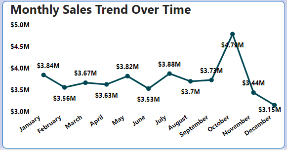

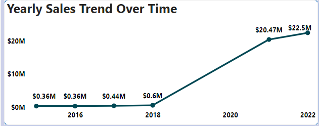
   
The sales trend has shown a consistent increase in total sales over the years, with a significant increase from 2015 to 2018. However, an exceptional surge is observed in 2021 and 2022, indicating a significant sales leap.

5.	What is the distribution of sales per order?

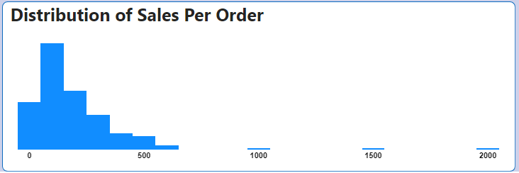
   
The distribution of sales per order exhibits a typical pattern, with the majority of orders falling within a certain range. However, the presence of three notable outliers suggests instances where individual orders significantly deviate from the norm.

6.	Which customer segments contribute the most to overall sales, and how do they compare to one another?

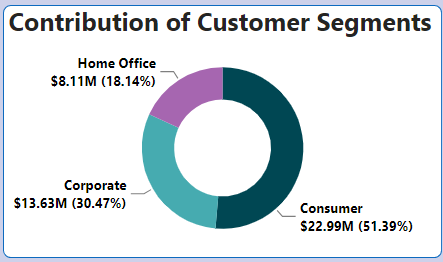
    
The analysis reveals that the consumer segment significantly outperforms other customer segments with $22.99M, making the highest contribution to overall sales. In comparison, the cooperate and home office segments, while substantial contributors, exhibits lower sales figures. 

7.	How does order item discount affect both sales per order and profit per order?

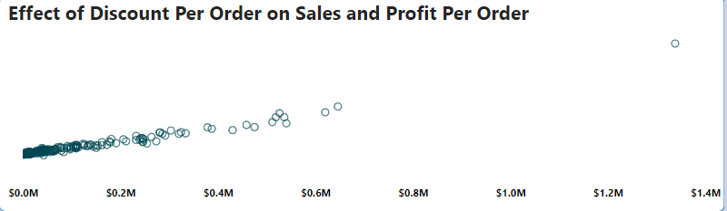
   
The analysis highlights that offering high discounts has a dual negative effect on both sales and profits. While it may attract more sales, the considerable reduction in profit margins raises concerns.

8.	How do different shipping types impact the delivery status of orders?

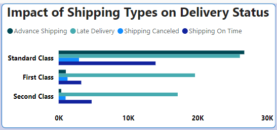
   
The analysis shows that in standard class, Advanced shipping and late delivery exhibit higher counts, indicating potential issues in timely deliveries. For first and second classes, the data suggests variations, highlighting the need for a targeted approach to optimize shipping processes.

9.	Are there any customer regions that stand out in terms of sales performance?

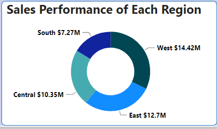
    
The regional analysis spotlights the West as a stand out performer in terms of sales, leading with $14.42M. following closely the East contributed significantly with $12.7M, while the Central region follow with $10.35M. In contrast, the South region, while contributing, lags behind with $7.27M. 

## RECOMMENDATION
1.	Continue to strategically use promotions and discounts, considering what worked well during the surge in 2021-2022. Experiment with different discount structures and promotional campaigns.
2.	Invest in optimizing e-commerce platforms for a seamless and user-friendly experience. Ensure that product pages, checkout processes, and overall website navigation are intuitive and efficient.
3.	Striking an optimal discount level is crucial to maintain profitability. Business should carefully evaluate the trade-offs, seeking a strategic approach that balances boosts sales with sustainable profit margins for long-term financial health.
4.	Understanding top buying customers like their preferences, purchase patterns, and engagement can offer strategic insights for personalized marketing, loyalty programs, and targeted initiatives.
 By nurturing relationships with these high-value customers, business have an opportunity to enhance customer satisfaction, foster loyalty, and potentially unlock additional revenue streams.
6.	The insight on high performing region, I recommend creating opportunities for strategic focus on high-performing regions and targeted initiatives to boost sales.
7.	Improving the supply chain to handle increased demand efficiently. Consider partnerships, diversification of suppliers, and inventory management tools to ensure product availability.
8.	There should be a focused attention on optimizing shipping processes, particularly in the standard class, to enhance on time deliveries and mitigate cancellations.

## DASHBOARD
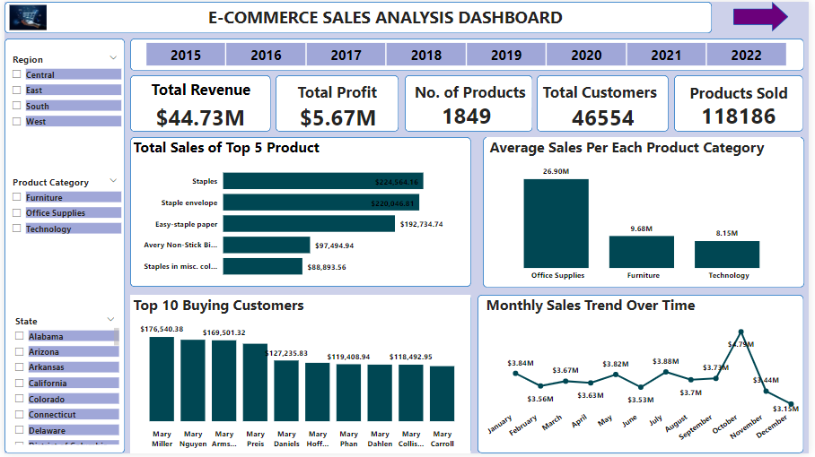

*[View Dashboard Here](https://app.powerbi.com/view?r=eyJrIjoiOTFmMzZiNGQtNWI3Yi00NzNiLWJiZWEtZjcxM2JjOWQ3OGYwIiwidCI6ImRmODY3OWNkLWE4MGUtNDVkOC05OWFjLWM4M2VkN2ZmOTVhMCJ9)*
